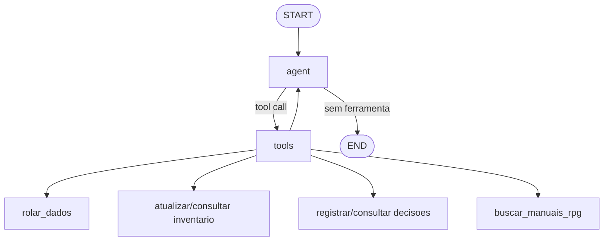

# Co-DM

Co-DM e um assistente colaborativo para mesas de RPG de mesa. Mestre e jogadores usam a mesma sessao para conversar com um agente LLM, consultar manuais em PDF, registrar decisoes coletivas, acompanhar inventario compartilhado e executar rolagens de dados.

O projeto incrementa a primeira entrega com LangGraph, RAG sobre PDFs, uma interface Streamlit com paineis fixos e testes unitarios para os principais componentes.

## Cenario Colaborativo

O cenario escolhido e uma mesa de RPG em andamento. Os usuarios simulados sao Mestre e jogadores, identificados por nome na interface. O agente Co-DM atua como apoio de coordenacao: ele nao substitui a criatividade do grupo, mas ajuda a recuperar regras dos manuais, organizar combinados e manter registros compartilhados.

Modelo 3C no sistema:

- Comunicacao: usuarios enviam mensagens identificadas por nome e recebem respostas do agente no historico da sessao.
- Colaboracao: o grupo constroi respostas, planos e decisoes com apoio do agente e dos documentos consultados por RAG.
- Coordenacao: ferramentas registram decisoes, inventario e rolagens, mantendo um estado comum da mesa.

## Funcionamento

O agente usa um fluxo ReAct com LangGraph. A cada mensagem, o LLM decide se responde diretamente ou chama uma ferramenta. As ferramentas atuais sao:

- `rolar_dados`: rola expressoes como `1d20`, `2d6+3` e registra o resultado.
- `atualizar_inventario_grupo`: adiciona, remove ou define quantidades no inventario compartilhado.
- `registrar_decisao_grupo`: registra decisoes coletivas confirmadas.
- `consultar_inventario_grupo`: consulta o inventario da sessao.
- `consultar_decisoes_grupo`: consulta decisoes recentes.
- `buscar_manuais_rpg`: busca informacoes nos PDFs em `app/manuals` usando RAG.

O RAG carrega ate 5 PDFs da pasta `app/manuals`, divide o texto em chunks, gera embeddings locais com `sentence-transformers/paraphrase-multilingual-MiniLM-L12-v2` e persiste o indice Chroma em `.chroma/codm_manuals`. Os manuais incluidos sao:

- `manual-jogador.pdf`
- `manual-mestre.pdf`
- `manual-monstros.pdf`

Na primeira busca, o modelo local de embeddings pode ser baixado automaticamente.

## Grafo LangGraph



O ciclo `agent -> tools -> agent` permite que o agente consulte ferramentas e depois gere uma resposta final em linguagem natural para o grupo.

## Como Rodar

Crie e ative um ambiente virtual:

```bash
python -m venv .venv
source .venv/bin/activate
```

No Windows PowerShell:

```powershell
.\.venv\Scripts\Activate.ps1
```

Instale as dependencias:

```bash
pip install -r requirements.txt
```

Crie um arquivo `.env` na raiz do projeto:

```env
OPENROUTER_API_KEY=coloque_sua_chave_aqui
OPENROUTER_MODEL=openai/gpt-4o-mini
APP_NAME=Co-DM
APP_ENV=dev

MANUALS_DIR=app/manuals
CHROMA_DIR=.chroma/codm_manuals
EMBEDDING_MODEL=sentence-transformers/paraphrase-multilingual-MiniLM-L12-v2
RETRIEVER_K=5
```
Extraia o zip do dos manuais de D&D:

```
Vá atá a pasta "manuals" e extraia diretamente nela. SENHA: 123
```

Execute a interface principal:

```bash
streamlit run app/streamlit_app.py
```

O projeto inclui `.streamlit/config.toml` com o watcher de arquivos desativado. Isso evita warnings do Streamlit ao inspecionar dependencias transitivas de `sentence-transformers`/`transformers` que tentam importar modulos opcionais de visao como `torchvision`, que nao sao necessarios para o RAG textual do Co-DM.

Na tela, escolha o ID da sessao, informe o nome do usuario/jogador e envie mensagens. Use o mesmo ID de sessao para simular multiplos usuarios trabalhando no mesmo estado compartilhado.

### Interface Streamlit

A interface principal foi organizada para manter os controles importantes sempre visiveis:

- A sidebar esquerda usa o painel nativo do Streamlit para configurar sessao, usuario ativo, novos jogadores, reset da sessao e lista de manuais carregados.
- A sidebar direita fica fixa na tela com os botoes da mesa: `Inventario da equipe`, `Decisoes` e `Rolagens`.
- O chat reserva espaco para a sidebar direita, evitando que mensagens e campo de entrada fiquem escondidos por baixo dos botoes.
- Em telas menores, a sidebar direita deixa de ser fixa e passa a aparecer no fluxo normal da pagina para preservar a leitura.

Exemplos de mensagens:

```text
Bran quer tentar barganhar. Rola 1d20+3.
```

```text
Registra que o grupo decidiu seguir pela estrada da floresta ao amanhecer.
```

```text
O que os manuais dizem sobre vantagem em testes?
```

```text
Qual e o inventario atual do grupo?
```

## API FastAPI Opcional

A API da primeira entrega continua disponivel:

```bash
uvicorn app.main:app --reload
```

Documentacao interativa:

- http://127.0.0.1:8000/docs
- http://127.0.0.1:8000/redoc

Endpoints principais:

- `POST /chat`
- `GET /sessions/{session_id}/state`
- `POST /sessions/{session_id}/reset`

Exemplo:

```bash
curl -X POST http://127.0.0.1:8000/chat \
  -H "Content-Type: application/json" \
  -d '{
    "session_id": "mesa-1",
    "player_name": "Lia",
    "message": "Consulte os manuais: como funciona vantagem?"
  }'
```

## Testes

Execute:

```bash
.venv/bin/python -m pytest
```

Tambem funciona com `pytest` se o ambiente virtual ja estiver ativo.

A suite atual cobre:

- RAG: descoberta de PDFs, limite de documentos, formatacao de trechos, resposta sem resultados e presenca da ferramenta `buscar_manuais_rpg`.
- Estado de sessao: normalizacao de IDs, rejeicao de IDs vazios, reset e snapshot serializavel.
- Ferramentas: rolagem de dados, validacoes de expressao/limites, atualizacao de inventario, registro e consulta de decisoes.
- Agente: execucao de uma rodada com agente falso, preservacao do historico, identificacao do jogador, coleta de tool calls e fallback de resposta vazia.
- API: respostas basicas das rotas de health, estado da sessao e reset.

Na ultima validacao local, a suite executou `20` testes com sucesso.
